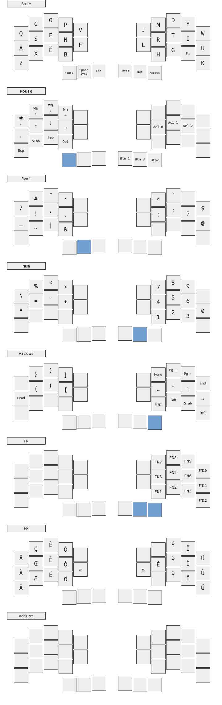
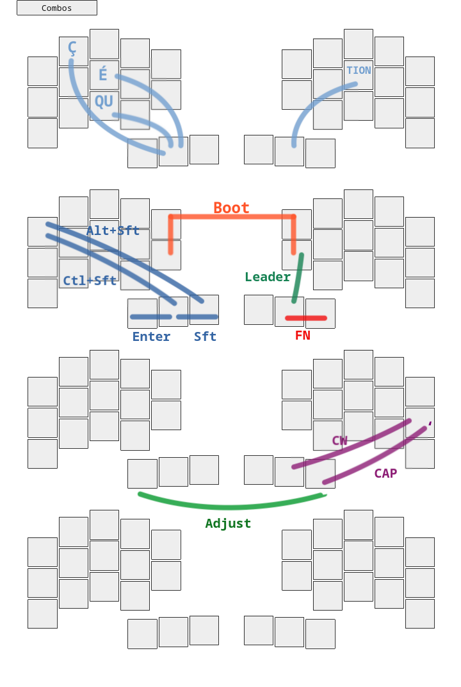

<div align="center">
    
</div>

This [QMK](https://docs.qmk.fm/#/) keymap has been made for the [Chew](https://github.com/flinguenheld/chew) keyboard.  
It works with both split and monobloc versions.  
It is inspired by [Ergo-L](https://ergol.org/) which is a French layout.  
Nonetheless it uses the [US international extended](https://github.com/qmk/qmk_firmware/blob/master/quantum/keymap_extras/keymap_us_extended.h) keymap for all French keys.  

It uses the [home-row-mods](https://precondition.github.io/home-row-mods): **A-G-C-S**  

You can also take a look on [rusty chew](https://github.com/flinguenheld/rusty_chew) which is the official custom firmware written in rust for chew 🦀 !

<div align="center">
    
</div>

### Install

Clone my QMK fork and active the branch *Chew_folders*  

```
    git clone https://github.com/flinguenheld/qmk_firmware_flo
    git checkout Chew_folders
```

Then move into one of this folders :  

```
    cd ~/qmk_firmware_flo/keyboards/chew/split/keymaps/
    cd ~/qmk_firmware_flo/keyboards/chew/mono/keymaps/
```

Press twice the *reset* button or maintain the boot button and plug the usb cable in, the controller should appear in your file explorer.  
And use this command :

```
    qmk compile && qmk flash
```

### Version


#### Mono

comment this line in *config.h*:
```
// #define SPLIT
```

#### Split

uncomment this line:
```
// #define SPLIT
```
And select a way to manage the master detection.  
With the gemini controller, the master is detected automatically thanks to the [pin 19](https://docs.keeb.supply/0xcb-gemini/guide/#split-capability) that you have to solder.  
While the RP2040-zero controller doesn't have a vbus, so you can try the qmk side detection or set and flash manually the roles.  
Take a look on the *config.h* file and the [QMK documentation](https://docs.qmk.fm/features/split_keyboard).  


<div align="center">
    
</div>

### Layout

<div align="center">
    
    
</div>

<div align="center">
    
    
</div>
