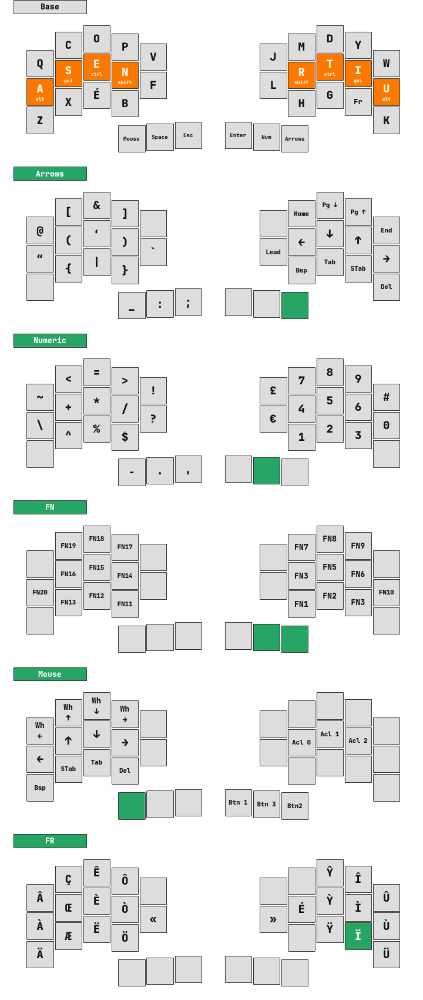
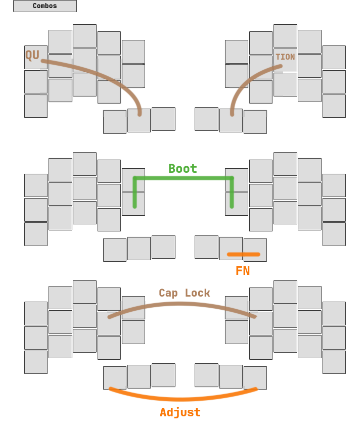

<div align="center">
    
</div>

This [QMK](https://docs.qmk.fm/#/) keymap has been made for the [Chew](https://github.com/flinguenheld/chew) keyboard.  
It works with both split and monobloc versions.  
It is inspired by [Ergo-L](https://ergol.org/) which is a French layout.  
Nonetheless it uses the [US international extended](https://github.com/qmk/qmk_firmware/blob/master/quantum/keymap_extras/keymap_us_extended.h) keymap for all French keys.  

It uses the [home-row-mods](https://precondition.github.io/home-row-mods): **A-G-C-S**

<div align="center">
    
</div>

### Install

Clone this repo in the folder :

    ~/qmk_firmware/keyboards/chew/split/keymaps/
    ~/qmk_firmware/keyboards/chew/mono/keymaps/

Move inside the folder and use this command :

    qmk compile && qmk flash

Finally press twice the *reset* button, the controller should appear in your file explorer.  

You can read the [Chew wiki](https://github.com/flinguenheld/chew/wiki) for more information.  

### Version

To select the version, open the *config.h* file and comment/uncomment these lines:

```
// #define SPLIT
// #define VBUS
```

<div align="center">
    
</div>

### Layout

<div align="center">
    
    
</div>

<div align="center">
    
    
</div>
